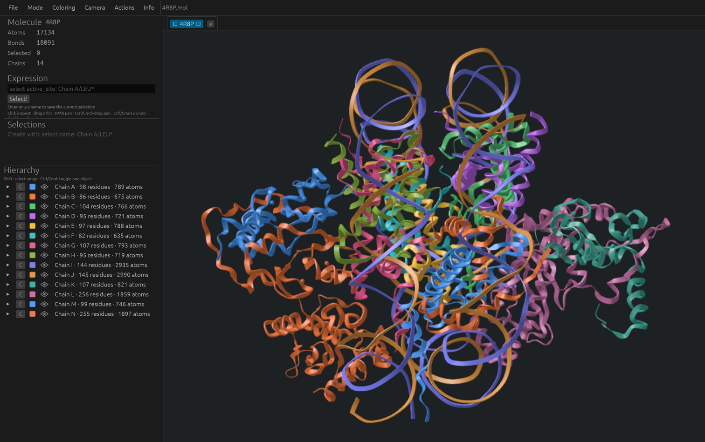

<p align="center">
  
</p>

<h1 align="center">Astra</h1>

<p align="center">
  <strong>Molecular visualization, inspection, and structure preparation.</strong><br>
  A native desktop application built with Rust, wgpu, and egui.
</p>

<p align="center">
  Windows · macOS · Linux<br>
  Open source · AGPL-3.0 · Active development
</p>

<p align="center">
  <a href="#build-and-dependencies">Build</a> ·
  <a href="#working-with-structures">Usage</a> ·
  <a href="#selections-and-commands">Selections</a> ·
  <a href="#experimental">Experimental</a> ·
  <a href="#architecture-and-development">Development</a>
</p>

Astra brings molecular structures, selections, measurements, and presentation
settings into one workspace. Explore assemblies through a chain–residue–atom
hierarchy, prepare selected residues, and save a complete project as a portable
`.mol` scene.

<p align="center">
  
</p>

<p align="center"><em>4R8P in the Astra workspace, with chain coloring and the molecular hierarchy.</em></p>

| Capability | What you can do |
| --- | --- |
| Open structures | Load PDB, PDBx/mmCIF, BinaryCIF, PDBML/XML, and gzip-compressed files, or fetch structures from RCSB PDB. |
| Explore in 3D | Switch between Cartoon, Ball & stick, and Toon; adjust coloring, ambient occlusion, and depth of field. |
| Select and inspect | Pick atoms, navigate the hierarchy, and build styled named selections with Boolean expressions. |
| Prepare structures | Restore missing protein heavy atoms and build explicit H at a specified pH in selected residues. |
| Measure distances | Create dashed measurement lines with distance labels and adjustable styling. |
| Keep your workspace | Work across tabs, save self-contained scenes, undo changes, and recover autosaved work. |

Experimental AMOEBA 2018 interaction analysis is available through
**Info → Enable experimental features**. See the
[energy model and validation](docs/amoeba.md) for its definition and limitations.

## Build and dependencies

### Common requirements

Install the current stable Rust toolchain using the
[official Rust installation guide](https://doc.rust-lang.org/book/ch01-01-installation.html).
The project uses Rust edition 2024. Build commands below should be executed from
the repository root.

Cargo resolves Rust dependencies from `Cargo.lock`. The build supplies its own
Protocol Buffers compiler and generates application icons from the included SVG;
a separate `protoc` installation is unnecessary. Native compilation tools and
graphics drivers depend on the platform.

| Platform | Native build tools | Graphics |
| --- | --- | --- |
| Windows | MSVC C++ Build Tools and Windows SDK | Vulkan by default; DX12 can be selected in the application |
| macOS | Xcode Command Line Tools | Metal |
| Linux | GCC or Clang, `pkg-config`, and X11/Wayland development libraries | Vulkan loader and a compatible GPU driver |

AMOEBA analysis is implemented in Rust with embedded AMOEBA 2018 parameters and
requires no additional runtime dependencies. Python 3 is used only by the macOS
packaging script and optional developer tools for regenerating reference data.

### Windows

Install Visual Studio Build Tools with the **Desktop development with C++**
workload and a Windows SDK, then install Rust with the MSVC toolchain. Use a
terminal in which Cargo and the native build tools are available.

```powershell
cargo build --release --locked
```

The executable is `target\release\astra.exe`. Open it directly, or provide a
structure path:

```powershell
.\target\release\astra.exe examples\minimal.pdb
```

Install the GPU manufacturer's graphics driver with Vulkan support. Astra also
provides a DX12 backend. Non-ARM64 MSVC builds link DXC into the application for
shader compilation.

### macOS

Install Xcode Command Line Tools:

```sh
xcode-select --install
```

Build the standalone executable:

```sh
cargo build --release --locked
```

The executable is `target/release/astra`. To create a Finder application with its
icon and bundle metadata, install Python 3 and use the packaging script:

```sh
python3 scripts/package_macos.py
```

The script builds the release executable and creates `target/release/Astra.app`
with an ad-hoc signature. Developer ID signing and notarization are separate
distribution steps. See [macOS packaging and application icons](docs/application-icon.md).

### Linux

Install a native compiler, the window-system development libraries, and a Vulkan
runtime. For a Debian/Ubuntu desktop, a starting package set is:

```sh
sudo apt update
sudo apt install build-essential pkg-config \
  libx11-dev libxrandr-dev libxi-dev libxcursor-dev \
  libxkbcommon-dev libxkbcommon-x11-dev libwayland-dev \
  libvulkan1 xdg-desktop-portal zenity
```

Install a Vulkan driver appropriate for the GPU. Intel/AMD systems using Mesa
can use `mesa-vulkan-drivers`; other drivers should come from the distribution
or GPU vendor.

File dialogs use XDG Desktop Portal. Install a file-picker portal backend
appropriate for the desktop, such as `xdg-desktop-portal-gtk`,
`xdg-desktop-portal-gnome`, or `xdg-desktop-portal-kde`. Zenity supplies fallback
file dialogs and message dialogs. See the
[rfd Linux backend requirements](https://docs.rs/rfd/0.17.2/rfd/#linux--bsd-backends).
Package names differ on other distributions.

Build and open the application:

```sh
cargo build --release --locked
./target/release/astra
```

A structure path can be passed as the first argument:

```sh
./target/release/astra examples/minimal.pdb
```

### AMOEBA analysis

AMOEBA 2018 is included in every build on all supported platforms. No interpreter
or separate force-field installation is needed. Analysis requires a complete
structure with explicit hydrogens and a supported protonation state; unmatched
residues are reported as `unparameterized`.

See [AMOEBA preparation, energy definition, and validation](docs/amoeba.md).

## Working with structures

### Opening files

Use **File → Open**, drag a file into the window, or pass a path to the executable.
Multiple files can be opened together; each structure or project receives its
own tab. **File → Fetch from PDB** downloads a structure by its RCSB PDB ID, with
progress reporting and cancellation. Downloads are stored in `~/downloads/pdb/`.

| Format | Extensions | Notes |
| --- | --- | --- |
| PDB | `.pdb`, `.ent` | Coordinate records and available connectivity |
| PDBx/mmCIF | `.cif`, `.mmcif` | Requires atomic coordinates |
| BinaryCIF | `.bcif` | Binary coordinate input |
| PDBML | `.xml` | Requires atomic coordinates |
| Astra project | `.mol` | Embedded structure, display settings, selections, measurements, and camera |

All coordinate formats also support gzip compression. Structure-factor files,
validation reports, and other files without atomic coordinates cannot be
displayed as molecular structures. Astra projects use a `MOLECULE` file signature;
MDL Molfile, which shares the `.mol` extension, is unsupported.

### Navigation and inspection

| Action | Control |
| --- | --- |
| Inspect an atom | Click it in the viewport |
| Orbit | Left-drag |
| Pan | Right-drag or Ctrl/Cmd+drag |
| Zoom | Mouse wheel or trackpad |
| Frame the structure | **Fit** |
| Select a hierarchy range | Shift-click rows at the same level |
| Toggle a hierarchy item | Ctrl/Cmd-click |
| Undo / redo | Ctrl/Cmd+Z / Ctrl/Cmd+R |
| Browse command history | Up / Down while the expression field is focused |

The hierarchy groups atoms by chain and residue. Clicking a row selects it;
its disclosure triangle controls expansion. The Inspector shows properties of
the selected atom, residue, or chain. User-facing names can be changed through
**Rename** without modifying the original molecular identifiers.

### Representations and appearance

**Mode** selects the global representation:

- **Cartoon** shows protein ribbons and nucleic-acid backbones. Protein secondary
  structure is inferred from backbone geometry. Ligands and residues without a
  cartoon backbone remain in Ball & stick.
- **Ball & stick** shows atoms and covalent connections.
- **Toon** shows space-filling atoms with illustrative outlines.

**Coloring** offers Element/CPK, Chain, Residue identity, Residue type, Secondary
structure, B-factor, and Uniform schemes. Chain coloring is the default.
**Mode** also provides ambient-occlusion controls.

Chains, residues, atoms, and named selections can override representation,
color, and visibility. More specific hierarchy overrides take precedence over
parent and named-selection settings. Visibility cycles through inherit, show,
and hide; a visible child can override a hidden parent. Context menus provide
**Reset to default** and **Set to children**.

### Camera and depth of field

**Camera** controls clipping, the orbit pivot, focus, and optical depth of field.
Focus can target an atom, residue, base, chain, or the current Inspector item.
The focus point remains in molecular coordinates as the camera moves.

Optical controls include focal length, sensor height, f-stop, blur radius,
quality, and circular or polygonal aperture shape. Measurement labels and the
interface remain sharp. See [depth-of-field implementation](docs/depth-of-field.md)
and [performance notes](docs/dof-performance.md) for algorithm details.

## Selections and commands

Use the expression field and **Select!** to evaluate selections or save a named
selection. Entering only a new name stores the current viewport/hierarchy
selection. A named selection can also be created directly:

```text
select active_site: chain A and resi 10-30
```

Named selections appear in the manager with their own hierarchy, style, and
visibility controls. **Edit expression** reevaluates a selection while retaining
its style. Renaming a selection updates stored references to its name.

### Selection syntax

Keywords are ASCII case-insensitive. Boolean precedence is `not`, `and`, `xor`,
then `or`; parentheses override that order.

| Selector | Example |
| --- | --- |
| All or no atoms | `all`, `none` |
| Element or atom name | `element C`, `name CA` |
| Residue name or number | `resn ALA`, `resi 42`, `resi 10-30` |
| Chain or PDB serial | `chain A`, `serial 123` |
| Record/category | `hetatm`, `polymer` |
| Named selection | `selection active_site` |
| Boolean composition | `chain A and (resn ASP or resn GLU)` |

Path expressions combine chain, residue, and atom masks:

```text
Chain A/LEU*
Chain B/[20:22, 70:71]
Chain A/LEU*/C*
../LEU* AND [20:30, 45:50]
```

Path masks are case-insensitive. `*` matches any sequence, `?` matches one
character, and `..` matches any chain. Bracketed lists support inclusive ranges.

### Commands

```text
select <expression>
select <name>: <expression>
color <name-or-#RRGGBB>, <expression>
show spheres|sticks, <expression>
hide spheres|sticks, <expression>
```

For example:

```text
select active_site: chain A and resi 1-2
color magenta, selection active_site
color #33aaff, chain A and element C
hide spheres, element H
```

Named colors include red, green, blue, yellow, orange, magenta, cyan, white, and
gray/grey. Syntax errors include the position of the invalid input.

## Measurements and interaction analysis

### Distance measurements

In **Actions**, choose two named selections as endpoints and select
**Create distance line**. Each endpoint must contain one atom or atoms belonging
to exactly one residue/base. Multi-atom endpoints use their atom centroid.

The result is an independent measurement object with a dashed line and a distance
label in ångströms. Its color, visibility, thickness, label size, and name can be
edited in the measurement panel. Creation, styling, and deletion support undo/redo.

### Structure preparation at a specified pH

**Actions → Prepare structure · pH** restores missing heavy atoms in standard
protein residues touched by a named selection, then builds explicit H on those
protein and water residues using tabulated
pKa values and AMOEBA templates. Choose pH (default 7.0) and the neutral histidine
tautomer. Heavy-atom restoration is enabled by default and can be disabled.
Existing heavy-atom coordinates remain fixed. The calculation runs natively and
supports cancellation and Undo/redo.

Separate reports list restored atoms, ambiguous protonation sites and skipped
residues. Saved named selections identify new heavy atoms and H. Reconstruction
requires N, CA and C anchors; missing backbone segments, ligands and nucleic-acid
heavy atoms are not rebuilt. Unsupported protonation states are reported rather
than substituted. Existing AMOEBA results must be recalculated after preparation.
See [preparation workflow, pKa table and limitations](docs/protonation.md).

## Experimental

Experimental tools are hidden by default. Enable **Info → Enable experimental
features** to reveal them under **Actions → Experimental features**. The switch
is off on each application launch.

### AMOEBA hydrogen-bond analysis

**Hydrogen bonds · AMOEBA 2018** takes one named selection and computes
continuous interaction scores for chemically eligible donor–H/acceptor candidates.
It uses permanent multipoles, mutual polarization, and vdW interactions:

```text
ΔE_pair = E_full − E_AB_decoupled
```

The decoupled evaluation removes only interactions between the two groups and
reconverges induced dipoles throughout the parameterized environment. Negative
scores indicate stabilizing coupling. A broad spatial cutoff limits candidate
search; distance and angle do not determine whether a candidate is displayed.
The display filter uses energy, with `ΔE < 0` as its default.

The result object stores all candidates, energy components, geometry diagnostics,
and parameterization status. Visible D–A pairs are drawn as styled distance lines.
Functional groups are defined as template-derived AMOEBA polarization domains;
multiple candidates can therefore share one group score. Scores are not additive
bond energies or binding free energies.

**Explicit hydrogens are required.** Unsupported or incomplete residues are marked
`unparameterized`; their covalently connected components are excluded without a
geometric fallback. The remaining structure supplies the polarization environment,
including atoms outside the named selection. Large structures can require long
CPU calculations. See [AMOEBA methodology and limitations](docs/amoeba.md).

## Projects, history, and recovery

**File → Save as** creates an Astra `.mol` project. Subsequent **Save** operations
replace it atomically. Projects embed molecular geometry, selections, styling,
measurements, AMOEBA results, and camera state using a versioned, compressed format.
See the [Molecule file-format specification](docs/molecule-format.md).

Tabs maintain independent display state, selections, measurements, camera, and
undo/redo history. Up to 50 non-camera edits can be undone. Camera movements and
structure loading are outside that history.

Unsaved tabs are marked and prompt before closing. Autosaves are written to a
separate recovery area. At startup, available recoveries offer **Restore**,
**Discard**, or **Later**. Restored scenes remain unsaved until written to a project
file; postponing recovery keeps the autosave for a later launch.

## Architecture and development

Astra is one Cargo package with separate molecular, selection, application, and
rendering layers.

| Module | Responsibility |
| --- | --- |
| `molecule` | Structure parsing, chemical data, topology, and AMOEBA analysis |
| `selection` | Selection syntax and evaluation against molecular data |
| `command` | Parsing user commands into typed actions |
| `camera` | Renderer-independent camera state and operations |
| `render` | GPU meshes, instances, pipelines, and post-processing |
| `scene` | Portable project serialization and compatibility |
| `ui` / `app` | Interaction widgets, state changes, and background work |

Core molecular and selection logic does not depend on a GPU or window.
`DisplayState` owns presentation attributes, and rendering derives its inputs
from explicit molecular, display, and camera state.

Run the standard checks before submitting changes:

```sh
cargo fmt --check
cargo check
cargo test
cargo clippy --all-targets --all-features -- -D warnings
```

Native AMOEBA numerical regressions run in the standard test suite against
committed OpenMM Reference fixtures. Regenerating those fixtures uses optional
Python development tools described in [AMOEBA validation](docs/amoeba.md).

## Current limitations

- Structure loading retains only the first model and blank/A alternate locations.
- Viewer connectivity uses approximate distance-based bond inference and stores
  no bond orders. AMOEBA builds its own template-based chemical topology.
- Molecular surfaces, electron-density maps, crystal-symmetry expansion, and
  trajectory playback are not implemented.
- There is no browser build.
- AMOEBA requires explicit-H structures; native pH preparation covers complete
  proteins and water. Ligand parameter generation and
  parameter-import controls are not implemented.

## License

Copyright © 2026 Thoisoi Three.

Astra is licensed under the GNU Affero General Public License v3.0 only
(`AGPL-3.0-only`). See [LICENSE](LICENSE) and [NOTICE](NOTICE).
